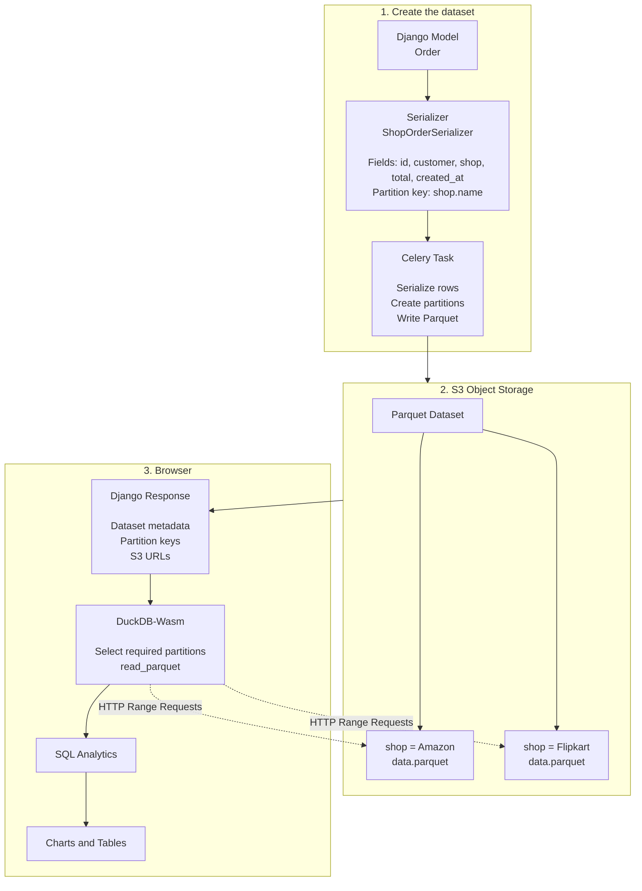
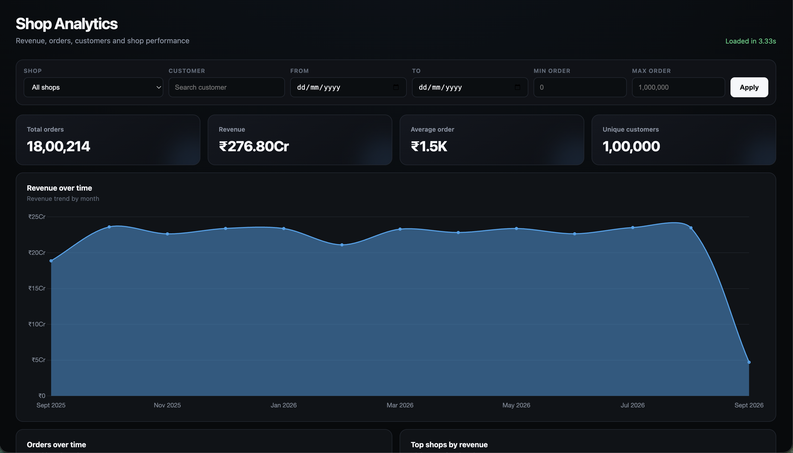
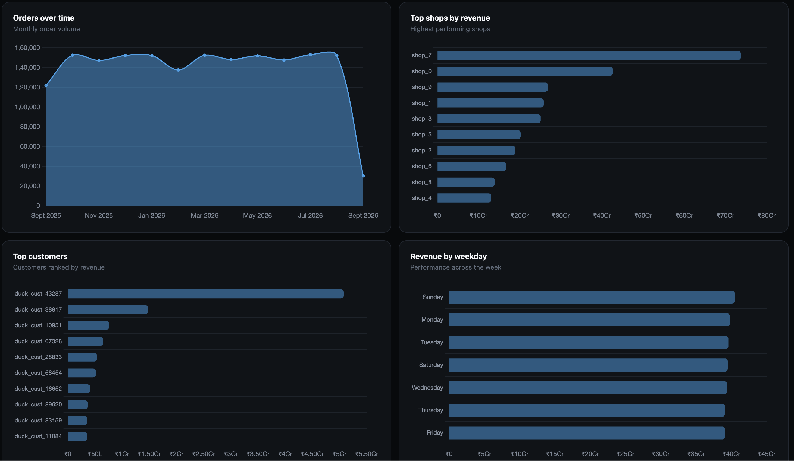

## Intro

A requirement for analytics page is something that will be raised one day or another in any application that deals with data and I've seen different companies deal with this problem in different ways depending on their requirements and the scale and budget.

At my previous company [Zelthy](https://www.zelthy.com/), when adding an analytics dashboard in one of our patient applications we simply added APIs that fetched the necessary data directly from the DB and passed it to the frontend which rendered the charts as the scale was not that high and the amount of data was also small.

This worked out well and we were able to deploy it quickly but it will pose problems if the size of the data that the application dealt with were to increase in the future or if the number of users increase.

At [PocketFM](https://pocketfm.com/) I saw how data analytics is dealt at scale, to ensure that all our analytics workflows are able to run smoothly without having any load on the primary or replica database we have setup CDC and airflow DAGs that push data to a datalake and we consume it using [Trino](https://trino.io/).

This scales pretty well and allows us to serve metrics without any noticable lag but needs dedicated teams to setup and maintain all of this and more importantly the budget to pay for everything.

## Can I have the best of both worlds??

What if you could have the best of both worlds?? A analytics setup that doesn't take down your DB when the number of requests or data volume increases or burn a hole in your pocket when setting it up to scale.

## Quack Quack

[DuckDB](https://duckdb.org/) is a OLAP database that can be used for analytics, it's similar to sqlite in that it does not require a dedicated server to run. You can just install it and run it on any machine. It supports reading from excel, json, parquet, databases and many other formats. One of the most interesting capabilities of duckdb is the ability to read data from a remote file. You can read data from a remote json or parquet file as if it was present on your disk


```shell
DuckDB v1.5.5 (Variegata)
Enter ".help" for usage hints.
memory D SELECT *
FROM 'https://example.com/data/orders.parquet';
```

This makes it easy to just read data from any remote file and perform operations on it.

## How does it solve our analytics problem??

One of the most fascinating things about DuckDB is that it can be run entirely in the browser using [WASM](https://duckdb.org/docs/lts/clients/wasm/overview), You can vist [DuckDB Shell](https://shell.duckdb.org/) to access a duckdb instance in the browser. This entirely eliminates the problem of having to bear the cost of deploying, setting up and maintaining a analytics database.

Armed with this, I created a simple library that exposes a Serializer which makes it easier to generate and write the parquet files and read it in the browser, you can check it out here [dj-duckgraph](https://github.com/deepakdinesh1123/duckgraph/tree/main/dj-duckgraph).

You can define the data that you want to upload to S3 like this

```python
from typing import Any

from dj_duckgraph.serializer import BaseParquetSerializer

from .models import Order


class OrderAnalyticsSerializer(BaseParquetSerializer):
    """
    Defines the analytics dataset exposed to the browser.

    The same serializer is used by the export task and by Django
    when returning partition metadata to the browser.
    """

    class Meta:
        name = "OrderAnalytics"
        model = Order

        # Fields written to Parquet.
        fields = [
            "id",
            "customer",
            ...
        ]

    def get_partition_key(self, obj) -> dict[str, Any] | None:
        """
        Determines which Parquet partition a row belongs to.

        For example:
            shop = "Amazon"
            -> shop=Amazon/data.parquet
        """
        return {
            "shop": obj.shop.name,
        }

    def has_access(self, request) -> bool:
        """
        Controls whether the current user can access this dataset.
        """
        return request.user.is_authenticated
```

and use it in a celery task to upload the data to S3 (you can use an task queue)

```python
from celery import shared_task

from .models import Order
from .serializers import OrderAnalyticsSerializer


@shared_task
def export_order_analytics():
    """
    Export Order data to partitioned Parquet files.
    """

    serializer = OrderAnalyticsSerializer()

    serializer.export_data()
```

And load the data in the template

```html




{{ dataset|json_script:"order-dataset" }}

<script type="module">
    const dataset = JSON.parse(
        document.getElementById("order-dataset").textContent
    );

    console.log(dataset);
</script>
```

## Architecture Diagram




## Results

I gennerated a orders dataset with 1 million records and converted it to parquet, the data was loaded into the analytics page in 3.3s. I can run any query that I want on this data without incurring any extra cost and there is no problem of scalability as the server only needs to provide the parquet URL, the actual querying happens in the browser.




## Further Improvements

- The performance can further be improved by choosing the correct partition keys and using pthreads to run the duckdb wasm workers.
- We can also choose charting libraries that natively support arrow data format to avoid the cost of converting the data to json
