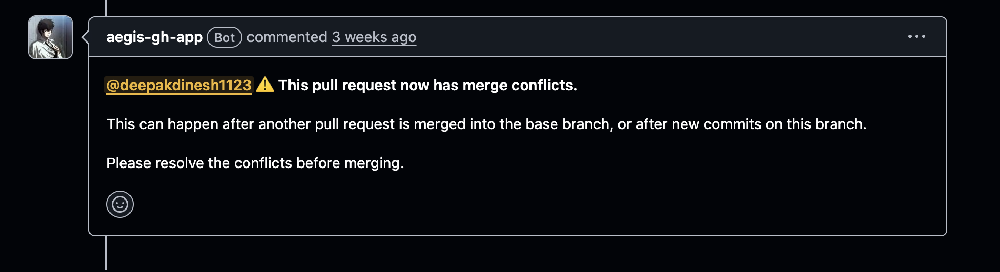
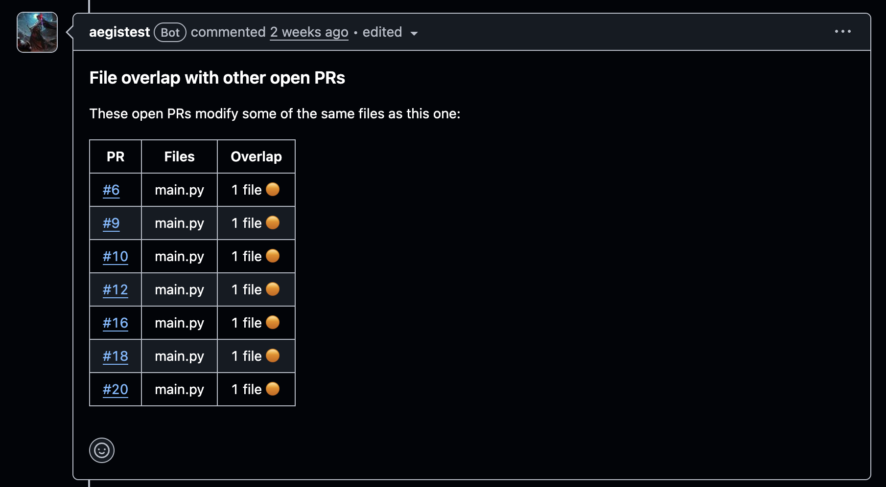

## An annoying problem

Whenever I am deploying a feature I get all the pull requests approved and keep the deployment plan ready and commit a time window to complete the deployment and move on to other planned work items. This has worked well for me since I was at a small startup where I often worked alone on features, but after switching to a larger company I came across a particularly annoying problem.

Since it is a large org I am not the only person deploying my feature, at any given point multiple people are working towards deploying their features which have changes in the same repo.

Recently I had this problem where I committed that I would deploy my features at this time and had everything ready and all the PRs were approved but, to my dismay, as I went to merge my PR I realised that one of them had merge conflicts and I had no idea about it since GitHub does not send any form of notification when your PR has conflicts.

It was small but, after resolving it, I had to ping my leads to approve the PR again. To my luck it was not that big but if there were significant conflicts I would've had to dev test it and deploy it on staging again and ping QA to give me sign-off since there were changes after the QA approval. All of this takes time and will eat into the bandwidth allocated to other planned tasks.

<!-- more -->

## What if you received a notification as soon as there was a merge conflict?

If I had received a notification as soon as there was a merge conflict I would have realised much earlier that I need to fix it before deploying and could have called it out and informed my leads that I'll need more time to complete the deployment.

So I created [Aegis](https://github.com/deepakdinesh1123/aegis), an open source GitHub app that continuously monitors your repositories and immediately informs you if your open PR has a merge conflict.

## How Aegis works?

Aegis is a GitHub app built using [Probot](https://probot.github.io/) that runs as an AWS Lambda function. When any pull request is opened, closed or synchronised Aegis receives a webhook event from GitHub and if the pull request has merge conflicts it adds a comment to inform the author.

```text
GitHub ──► webhook ──► notifier ──► SQS ──► worker
   │                                             │
   │                                             ├──► GitHub API
   │                                             │
   │                                             └──► DynamoDB
   │
   └──► target branch updates trigger rechecks
```

Aegis has two Lambda functions:

- notifier
- worker

Notifier listens to webhook events and after basic checks pushes a message to SQS indicating the worker to check for merge conflicts in the specified PR and includes the required context in the message. The worker then picks up these messages and processes them.

The merge conflict information is already present on GitHub and can be accessed through an API so you don't even need to clone the repo or anything. But GitHub takes time to compute it which is why we chose a worker architecture. If the merge conflict information is not available at the given moment the worker just processes the message again later.

DynamoDB is used to store data related to pull requests so that we don't end up hitting the GitHub API again and again running into rate limits.

## Self hosting Aegis

Aegis is open source and you can run it completely within your own AWS account. I have included OpenTofu templates in the repo to make setting it up easier.

You will need OpenTofu, AWS credentials and a GitHub App. The OpenTofu templates take care of creating the AWS infrastructure required by Aegis.

First clone the repo and move into the OpenTofu directory.

```bash
git clone https://github.com/deepakdinesh1123/aegis.git
cd aegis/opentofu
```

Create your variables file from the example provided in the repo and fill in the required values for your GitHub App and AWS setup.

```bash
cp terraform.tfvars.example secret.tfvars
```

Then initialise OpenTofu and create the infrastructure.

```bash
tofu init
tofu plan -var-file=secret.tfvars
tofu apply -var-file=secret.tfvars
```

Once the infrastructure is created, OpenTofu will output the webhook URL that you need to configure in your GitHub App.

Add this URL as the webhook URL in your GitHub App, configure the webhook secret and install the GitHub App on the repositories you want Aegis to monitor.

That's it, Aegis should now be running completely inside your AWS account.

## Result



As soon as there's a merge conflict a comment like this is added on your PR which can send you an email and a notification on your GitHub mobile app, which helps you react to it.

## Bonus

After showing this to [Sujay](https://github.com/Sujay-J-Reddy), he asked, what if we could warn users that there could be a merge conflict before anything gets merged?

So he added a new feature to Aegis that shows files which are being modified by multiple open PRs.

For example, if I open a PR which changes `auth.py` and Aegis sees that two other open PRs are also modifying `auth.py`, it will show me that there is an overlap between these PRs.

This doesn't mean there will definitely be a merge conflict since the PRs could be modifying different parts of the file, but it gives you an early warning that there could be a conflict.

This means you don't have to wait until another PR gets merged to find out that your PR has a conflict. You can see the potential merge risk as soon as you open your PR and coordinate with the people working on the other PRs before they get to the point of merging.

