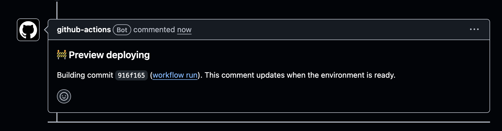
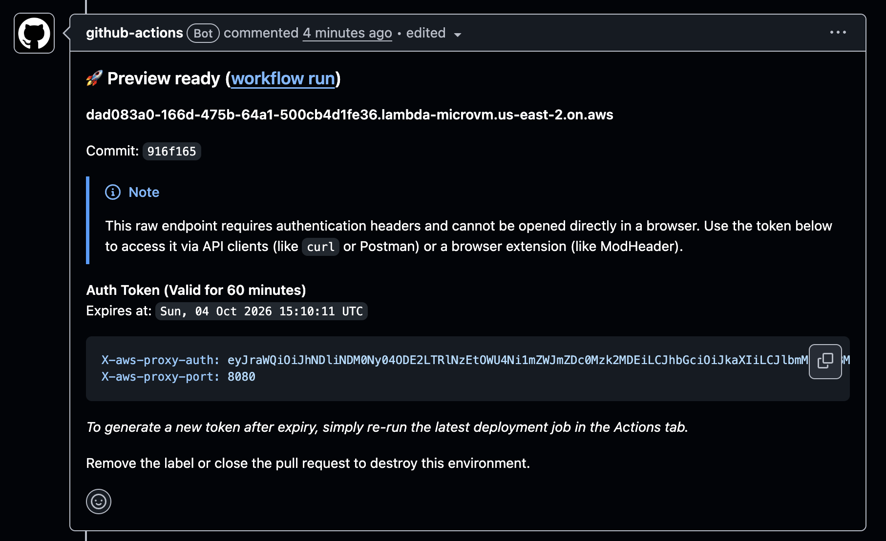
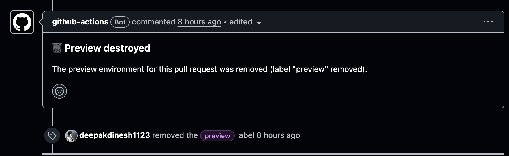

## Problem

Testing locally especially when multiple services are involved or there is a heavy reliance on a specific state of data increases the feature development time heavily. Several bugs are also caught only after it is deployed to QA.

Feature branch deployments solve this problem really well and allow you to focus on application logic without worrying about local setup or syncing data. Since the staging environment usually has some level of prod parity, you can be more confident about your changes and make sure that nothing breaks on QA without having to deploy multiple times.

But setting this up is not so easy.

You either need to pay a third party service a lot of money or you need to write your own service that handles setup and teardown efficiently. Doing this requires expertise and costs you both development time and hosting cost, which might end up costing more than the third party service.

<!-- more -->

## What is the solution??

We need something that can be spun up quickly and gets automatically cleaned up. It should not require setting up VMs manually or deploying a Kubernetes cluster just to run a temporary environment.

I found out that AWS recently introduced [Lambda MicroVMs](https://aws.amazon.com/lambda/lambda-microvms/), which turned out to be a really good fit for this.

The interesting part about MicroVMs is that AWS handles most of the underlying compute lifecycle for you. You get an isolated environment with a dedicated HTTPS endpoint, without having to provision an EC2 instance or set up a load balancer just to expose the application.

The part that makes this particularly useful for feature branch deployments is how the idle lifecycle works.

A MicroVM can be configured to automatically suspend after it has not received traffic for a certain amount of time. When it is suspended, its memory and disk state are preserved, so if `autoResumeEnabled` is enabled, another request can resume the MicroVM instead of starting the application from scratch.

You can also configure how long the MicroVM can remain suspended before AWS terminates it, as well as a maximum lifetime for the MicroVM.

For example, you can have a preview environment that is running while someone is actively testing it, gets suspended after being idle for some time and eventually gets terminated if nobody comes back to it.

This is exactly what I want from a feature branch environment.

Most feature branches are not being used all the time. A developer might deploy a branch, test it for 20 minutes and then leave it untouched for several hours.

With a traditional VM, the VM is still sitting there unless something else comes along and cleans it up.

With MicroVMs, the idle behaviour is already part of the compute primitive.

So instead of having to build another service that keeps track of inactive environments, you can configure the MicroVM's own lifecycle.

You can also set `maximumDurationInSeconds`, which puts a hard limit on how long a MicroVM can run. AWS currently supports a maximum duration of 8 hours.

This is useful for preview environments because it gives you another safety net if someone forgets about a branch.

The lifecycle can basically look like this:

```text
                    Preview created
                          |
                          v
                       RUNNING
                          |
                    no traffic
                          |
                          v
                      SUSPENDED
                          |
               traffic    |    timeout
                  |       |       |
                  |       |       v
                  |       |   TERMINATED
                  |       |
                  v       |
                RUNNING   |
```

A suspended MicroVM does not incur compute charges, and once it is terminated the environment is gone completely.

This is probably the biggest reason I think MicroVMs are a good fit for this problem.

## Implementation

I designed a GitHub Action that deploys your application to a Lambda MicroVM and gives you a public URL that you can use to access it.

You just need to point the action to the Dockerfile of your application, provide the S3 path and build ARN, and authenticate with AWS.

For authentication you can use GitHub Actions OIDC, or provide an AWS access key and secret key if you are not using OIDC.

[PReview](https://github.com/deepakdinesh1123/PReview?utm_source=chatgpt.com)

All you need to do is open your PR and add the `preview` label to it and it will automatically get deployed.

Since the MicroVM can use a network connector to access resources through your VPC, the application can communicate with the other services that are already running in your QA environment.

For example, if your QA environment already has a database, Redis and other internal services, the preview can use those instead of having to create another copy of everything for every pull request.

```text
                         AWS
                          |
                    Public HTTPS URL
                          |
                          v
                  +---------------+
                  | Preview       |
                  | MicroVM       |
                  +---------------+
                          |
                       VPC
                          |
              +-----------+-----------+
              |           |           |
              v           v           v
           QA API      PostgreSQL    Redis
```

You still need to configure the appropriate networking and security groups, but you don't need to create a completely separate environment for all of the services.

## Setting it up

The application just needs to be able to run using a Dockerfile.

For example, a Django application could have something like:

```dockerfile
FROM python:3.12-slim

WORKDIR /app

COPY requirements.txt .
RUN pip install -r requirements.txt

COPY . .

EXPOSE 8080

CMD ["gunicorn", "app.wsgi:application", "--bind", "0.0.0.0:8080"]
```

The same thing works for Go, Node.js or pretty much any application that can run inside a container.

For PReview, you provide the S3 path where the build is stored and the build ARN.

For AWS authentication, you can either use GitHub Actions OIDC or provide an AWS access key and secret key.

If you are using OIDC, the IAM role can be restricted to the repository that is going to deploy the previews.

Once this is configured, the rest of the workflow is handled by the GitHub Action.

You don't need to create a VM for every branch or manually manage the lifecycle of the environment.

## Using it

Once everything is configured, the developer workflow is very simple.

Add this to your github workflows folder

```yaml
name: Feature branch deployment

on:
  pull_request:
    types:
      - labeled
      - unlabeled
      - closed
      - synchronize

permissions:
  contents: read
  pull-requests: write

jobs:
  preview:
    if: |
      github.event.action == 'closed' ||
      contains(github.event.pull_request.labels.*.name, 'preview')

    runs-on: ubuntu-latest

    steps:
      - name: Checkout
        uses: actions/checkout@v4

      - name: Deploy preview
        uses: deepakdinesh1123/PReview@main
        with:
          s3_path: ${{ secrets.PREVIEW_S3_PATH }}
          build_arn: ${{ secrets.PREVIEW_BUILD_ARN }}
          aws_access_key_id: ${{ secrets.AWS_ACCESS_KEY_ID }}
          aws_secret_access_key: ${{ secrets.AWS_SECRET_ACCESS_KEY }}
```

You create a PR:

```text
feat/new-checkout-flow
```

and add the `preview` label.

The GitHub Action starts building and deploying the application.



After the deployment is complete, the action gives you a token and a public URL.



You can now open the URL and test the exact code from your branch.

This is useful when you have something like a frontend change that depends on a backend change in the same branch.

Instead of deploying the branch to a shared QA environment and asking everyone to test it there, you can just give them the preview URL.

If you push another commit to the PR, the deployment can be updated again.

Once you're done with the branch, you can remove the `preview` label or close the pull request and the MicroVM gets destroyed.



